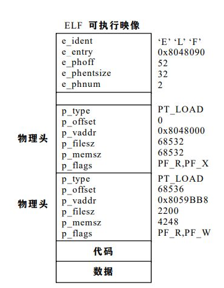

# 进程的创建和执行
## 进程的创建
新的进程通过克隆旧的程序（当前进程）而建立。fork()和clone()系统调用可用来建立新的进程。这两个系统调用结束时，内核在系统的物理内存中为新的进程分配新的task_struct结构，同时为新进程要使用的堆栈分配物理页。Linux还会为新的进程分配新的进程标识符。然后，新task_struct结构的地址保存在链表，而旧进程的task_struct结构内容被复制进新的task_struct结构中。
克隆进程时，Linux允许两个进程共享相同的资源，包括文件、信号处理程序、虚拟内存等。某个资源被共享时，其引用计数会加1。
而系统也需要对进程的虚拟内存进行克隆。新的vm_area_struct结构、新进程的mm_struct结构以及新进程的页表必须在一开始就准备好，但这时不复制任何虚拟内存。如果旧进程的某些虚拟内存在物理内存中，而有些在交换文件中，则虚拟内存的复制会变得非常困难。
Linux采用了写时复制的技术，只有当两个进程中的任意一个向虚拟内存中写入数据时才复制相应的虚拟内存；而没有写入的任何内存页均可在两个进程之间共享。代码页实际总是可以共享的。
此外，内核线程是调用kernel_thread()函数创建的，其在内核态调用了clone()系统调用。内核线程通常没有用户地址空间，即p->mm=NULL，它总是访问内核地址空间。
fork()和clone()系统调用都调用了内核中的do_fork()。其代码在kernel/fork.c中。由于代码过长不列出，仅给出代码解释：
* 给局部变量赋初值-ENOMEM，当分配一个新的task_struct结构失败时就返回这个值。
* 如果在clone_flags中设置了CLONE_PID标志，就返回一个错误。
* 调用alloc_task_struct()为子进程分配两个连续的物理页面，低端用来存放子进程的task_struct结构，高端用作其内核空间的堆栈。
* 用结构赋值语句*p=*current把当前进程task_struct结构中的所有内容都拷贝到新进程中。稍后，子进程不该继承的域会被设置成正确的值。
* 每个用户有且仅有一个user_struct结构，指针为user。属于同一用户的进程通过指针user共享这些信息。而内核进程不属于任何用户，所以user指针为0。若一个用户拥有的进程数量超过界限值，就不允许再fork()。除此之外，也需要检查系统中的所有线程数是否超过最大值。
* 将进程的状态设置为WASK_UNINTERRUPTIBLE。
* copy_flags()函数将clone_flags参数中的标志位略加补充和变换，然后写入p->flags。
* get_pid()函数根据clone_flags中标志位CLONE_PID的值，或返回父进程的pid，或返回一个新的pid。
* 然后对子进程task_struct结构进行初始化（复制时只是照抄过来，很多域需要重新赋值）。
* copy_files()有条件地复制已打开文件的控制结构，也就是说，这种复制只有在clone_flags中的CLONE_FILES标志为0时才真正进行，否则只是共享父进程的已打开文件。copy_fs()也是只有在clone_flags中的CLONE_FS标志为0时才加以复制。类似地，copy_sighand（）也是只有在CLONE_SIGHAND为0时才真正复制父进程的信号结构，否则就共享父进程。
* 用户空间的继承是通过copy_mm()函数完成的。进程的task_struct结构中有一个指针mm，就指向代表着进程地址空间的mm_struct结构。对mm_struct的复制也是在clone_flags中的CLONE_VM标志为0时才真正进行，否则，就只是通过已经复制的指针共享父进程的用户空间。
* 到此，task_struct结构中的域就基本复制完毕，但用于内核堆栈的内容还没有复制，此时调用copy_thread()来完成，定义于arch/i386/kernel/process.c中。copy_thread（）实际上只复制父进程的内核空间堆栈。 堆栈中的内容记录了父进程通过系统调用fork()进入内核空间、然后又进入copy_thread（）函数的整个历程，子进程将要循相同的路线返回，所以要把它复制给子进程。但是，如果父 子进程的内核空间堆栈完全相同，那返回用户空间后就无法区分哪个是子进程了，所以，复制以后还要略作调整。
* 将父进程的时间片分成两半，让父子进程各有原值的一半。
* 通过task_struct结构中的队列头thread_group与父进程链接起来，形成进程组。
* 建立进程的家庭共享。即建立起子进程的祖先和双亲，然后通过SET_LINKS()宏将子进程的task_struct结构插入到内核中其他进程组成的双向链表中。通过hash_pid()将其链入按其pid计算得的哈希表中。
* 通过wake_up_process()将子进程唤醒。

到此，子进程的创建已完成，此时从内核态返回用户态。实际上，fork()系统调用执行之后，父子进程返回到用户空间中相同的的地址，用户进程根据fork()的返回值分别安排父子进程执行不同的代码。
## 程序执行
Linux中的程序和命令通常由命令解释器执行，这一命令解释器称为shell。用户输入命令之后，shell会在搜索路径指定的目录中搜索和输入命令匹配的映像名称。如果匹配，则装载并执行该映像。shell首先利用fork系统调用建立子进程，然后用找到的可执行映像文件覆盖子进程正在执行的shell二进制映像。
可执行文件可以是具有不同格式的二进制文件，也可以是一个文本的脚本文件。可执行映像文件中包含了可执行代码及数据，同时也包含操作系统用来将映像正确装入内存并执行的信息。Linux 使用的最常见的可执行文件格式是ELF和a.out，但理论上讲Linux有足够的灵活性可以装入任何格式的可执行文件。
### ELF可执行文件
ELF意为“可执行可连接格式”，是Linux中最常使用的格式，和其他格式相比其装入内存时多一些系统开支，但更为灵活。包含可执行代码和数据，通常也称为正文和数据。文件包含一些表，根据这些表中的信息，内核可组织进程的虚拟内存；另外文件还含有对内存布局的定义以及起始执行的指令位置。
这里举出一个简单程序的源代码：
```
#include
main （） {
printf（“Hello world!\n”）;
}
```
上述源代码利用编译器编译并链接后的ELF可执行文件格式如图所示：



可执行映像文件的开头是3个字符“E”、“L”和“F”，作为这类文件的标识符。e_entry定义了程序装入之后起始执行指令的虚拟地址。ELF映像利用两个“物理头”结构分别定义代码和数据，e_phnum是该文件中所包含的物理头信息个数。e_phyoff是第一个物理头结构在文件中的偏移量，e_phentsize是物理头结构的大小，这两个偏移量均从文件头开始算起。
物理头结构的p_flags字段定义了对应代码或数据的访问属性。图中第1个p_flags字段的值为FP_X和FP_R，表明该结构定义的是程序的代码；类似地，第2个物理头定义程序数据，并且是可读可写的。p_offset定义对应的代码或数据在物理头之后的偏移量。p_vaddr定义代码或数据的起始虚拟地址。p_filesz和p_memsz分别定义代码或数据在文件中的大小以及在内存中的大小。
Linux利用请页技术装入程序映像。当shell进程利用fork()系统调用了子进程后，子进程会调用exec()系统调用，exec()将利用ELF二进制格式装载器装载ELF映像，当装载器检验映像是有效的ELF文件，就将当前进程的可执行映像从虚拟内存清除，同时清除任何信号处理程序并关闭所有打开的文件，然后重置进程页表。完成之后，根据ELF文件的信息将映像代码和数据的地址分配并设置相应的虚拟地址区域，修改进程页表。这时进程就能开始执行对应ELF映像的指令了。
### 命令行参数和shell环境
当用户敲入一个命令时，从shell可以接受一些命令行参数。例如：
```
$ ls -l /usr/bin
```
此时，shell进程创建一个新进程执行这个命令。这个新进程装入bin/ls可执行文件。在此过程中，从shell继承的大多数执行上下文被丢弃，但3个单独的参数ls、-l和和/usr/仍然被保持。
传递命令行参数的约定依赖于所用的高级语言。在C中，程序的main()把传递给程序的参数个数和指向字符串指针数组的地址作为参数。
```
int main（int argc, char *argv[]）
```
其中，arge为参数个数，argv[]为字符串指针数组，第3个参数为可选，是包含环境变量的参数。当进程用到它时，main()的声明改变如下：
```
int main（int argc, char *argv[], char *envp[]）
```
envp指向环境串的指针数组。环境变量用来定制进程的执行上下文，为用户或其他进程提供一般的信息，或允许进程交叉调用execve()系统调用保存一些信息。
命令行参数和环境串都放在用户态堆栈。
### 函数库
每个高级语言的源代码文件都是经过几个步骤才转化为目标文件的，而链接程序在把程序的目标文件收集起来并构造可执行文件时，还会分析程序所用的库函数并把它们粘合成可执行文件。
传统UNIX系统使用的是基于静态库的可执行文件，这样会导致大量的磁盘空间被占用——因为每个静态链接的可执行文件都复制库代码的一部分。因此，现代UNIX系统利用共享库。可执行文件不用包含库的目标代码而仅指向库名，将某一共享库链接到进程时，只需要执行内存映射，将库文件相关部分映射到进程的地址空间中。这就允许共享库机器代码所在的页面由使用相同代码的所有进程共享。
然而这样链接的程序启动时间比静态链接的更长。且可移植性也不算好。
## 执行函数
执行fork()之后，子进程具有与父进程相同的可执行程序和映像。因此，父进程要调用execve()装入并执行子进程自己的映像。execve()函数必须定位可执行文件的映像然后装入并执行它。
Linux文件系统采用linux_binfmt数据结构来支持各种文件系统，因此Linux中的exec()函数执行时，使用已注册的linux_binfmt结构就可支持不同的二进制格式。linux_binfmt结构中有两个指向函数的指针，一个指向可执行代码，另一个指向库函数，以便装入可执行代码和库。其链表结构的代码如下：
```
struct linux_binfmt {
struct linux_binfmt * next;
long *use_count;
int （*load_binary）（struct linux_binprm *, struct pt_regs * regs）;/*装入二进制代码*/
int （*load_shlib）（int fd）; /*装入公用库*/
int （*core_dump）（long signr, struct pt_regs * regs）;
```
注意，在使用这种数据结构前需要调用vod binfmt_setup()函数进行初始化，即用register_binfmt（struct linux_binfmt * fmt）函数把文件格式注册到系统中（加入* formats所指的链中）。
### execve()函数
Linux所提供的系统调用名为execve()，C语言的程序库在此系统调用的基础上向应用程序提供了一整套的库函数。
该函数在内核的入口为sys_execve()，代码在arch/i386/kernel/process.c：
```
/*
* sys_execve（） executes a new program.
*/
asmlinkage int sys_execve（struct pt_regs regs）
{
int error;
char * filename;
filename = getname（（char *） regs.ebx）;
error = PTR_ERR（filename）;
if （IS_ERR（filename））
goto out;
error = do_execve（filename, （char **） regs.ecx, （char **） regs.edx, ®s）;
if （error == 0）
current->ptrace &= ~PT_DTRACE;
putname（filename）;
out:
return error;
}
```
系统调用进入内核时，regs.ebx中的内容为应用程序中调用相应的库函数时的第1个参数，这个参数就是可执行文件的路径名。但是此时文件名实际上存放在用户空间中，所以getname()要把这个文件名拷贝到内核空间，在内核空间中建立起一个副本。然后，调用do_execve（）来完成该系统调用的主体工作。do_execve（）的代码在fs/exec.c中：
```
/*
* sys_execve（） executes a new program.
*/
int do_execve（char * filename, char ** argv, char ** envp, struct pt_regs * regs）
{
struct linux_binprm bprm;
struct file *file;
int retval;
int i;
file = open_exec（filename）;
retval = PTR_ERR（file）;
if （IS_ERR（file））
return retval;
bprm.p = PAGE_SIZE*MAX_ARG_PAGES-sizeof（void *）;
memset（bprm.page, 0, MAX_ARG_PAGES*sizeof（bprm.page[0]））;
bprm.file = file;
bprm.filename = filename;
bprm.sh_bang = 0;
bprm.loader = 0;
bprm.exec = 0;
if （（bprm.argc = count（argv, bprm.p / sizeof（void *））） < 0） {
allow_write_access（file）;
fput（file）;
return bprm.argc;
}
if （（bprm.envc = count（envp, bprm.p / sizeof（void *））） < 0） {
allow_write_access（file）;
fput（file）;
return bprm.envc;
}
retval = prepare_binprm（&bprm）;
if （retval < 0）
goto out;
retval = copy_strings_kernel（1, &bprm.filename, &bprm）;
if （retval < 0）
goto out;
bprm.exec = bprm.p;
retval = copy_strings（bprm.envc, envp, &bprm）;
if （retval < 0）
goto out;
retval = copy_strings（bprm.argc, argv, &bprm）;
if （retval < 0）
goto out;
retval = search_binary_handler（&bprm,regs）;
if （retval >= 0）
/* execve success */
return retval;
out:
/* Something went wrong, return the inode and free the argument pages*/
allow_write_access（bprm.file）;
if （bprm.file）
fput（bprm.file）;
for （i = 0 ; i < MAX_ARG_PAGES ; i++） {
struct page * page = bprm.page[i];
if （page）
__free_page（page）;
}
return retval;
}
```
filename为执行文件的文件名，argv为命令行参数，envp为环境串。
首先，将给定可执行程序的文件找到并打开（由open_exec()完成）。open_exec()返回一个file结构指针，代表着所读入的可执行文件的映像。
对局部变量bprm的各个域进行初始化。其中bprm.p几乎等于最大参数个数所占用的空间；bprm.sh_bang表示可执行文件的性质，当可执行文件是一个shell脚本时为。此时还没有可执行shell脚本，因此其与另外两个域均赋值0。
count()对字符串数组argv[]中参数的个数进行计数。同样，对环境变量也要统计个数。如果count()小于0，则统计失败，调用fput()把该可执行文件写回磁盘，并在写之前调用allow_write_access()来防止其他进程通过内存映射改变该可执行文件的内容。
完成对参数和环境变量的计数后，就调用prepare_binprm()对bprm变量做进一步的准备工作。更具体的说，是从可执行文件中读入开头的128个字节到linux_binprm结构的缓冲区buf。
然后就调用copy_string把参数以及执行的环境从用户空间拷贝到内核空间的bprm变量中，而调用copy_string_kernel()从内核空间中拷贝文件名。
最后调用search_binary_handler()函数。
### search_binary_handler()函数
观察图片6_18（ELF可执行文件）可知，一个静态变量formats指向了链表队列的头，挂在这个队列中的成员代表着各种可执行文件的格式。
search_binary_handler()函数的作用为扫描formats队列，直到找到一个匹配的可执行文件格式并运行，如果没有找到，就根据文件头部的信息来查找是否有为此种格式设计的可动态安装的模块，如果有则安装进内核并挂入formats队列，然后重新扫描。

到此，我们分别介绍了初始化、地址映射、内存分配与回收、请页机制、交换机制、缓存和刷新机制、程序的创建及执行等8个方面，对Linux内存部分的主要内容进行了大致介绍。
需要注意，在Linux系统中，CPU不能按物理地址访问存储空间，而必须使用虚拟地址。因此，对于Linux内核映像，即使系统启动时将其全部装入物理内存，也要将其映射到虚拟地址空间中的内核空间，而对于用户程序，其经过编译、链接后形成的映像文件最初存于磁盘，当该程序被运行时，先要建立该映像与虚拟地址空间的映射关系，当真正需要物理内存时，才建立地址空间与物理空间的映射关系。
