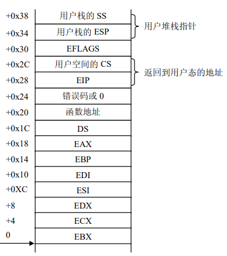
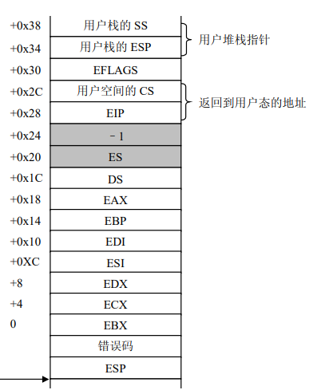
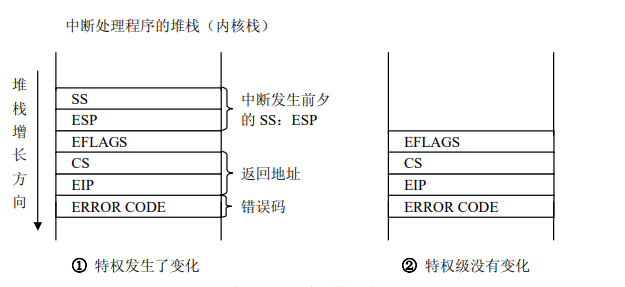
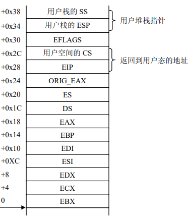
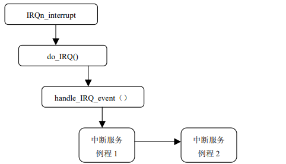

# 1.异常处理
Linux 利用异常来达到两个截然不同的目的： 
* 给进程发送一个信号以通报一个反常情况； 
* 处理请求分页。   

内核对异常处理程序的调用有一个标准的结构，它由以下 3 部分组成：
* 在内核栈中保存大多数寄存器的内容（由汇编语言实现）； 
* 调用 C 编写的异常处理函数； 
* 通过 ret_from_exception()函数从异常退出。
## 1.1 在内核栈中保存寄存器的值
所有异常处理程序被调用的方式比较相似，因此，我们用 `handler_name`来表示一个通用的异常处理程序的名字进入异常处理程序的汇编指令在`arch/I386/kernel/entry.S`中
```armasm
handler_name: 
 pushl $0 /* only for some exceptions */ 
 pushl $do_handler_name 
jmp error_code 
```
例如overflow
```armasm
overflow： 
 pushl $0
 pushl $ do_overflow 
 jmp error_code
```
当异常发生时，如果控制单元没有自动地把一个硬件错误代码插入到栈中，相应的汇编语言片段会包含一条 pushl $0 指令，在栈中垫上一个空值；如果错误码已经被压入堆栈，则没有这条指令。然后，把异常处理函数的地址压进栈中，函数的名字由异常处理程序名与 do_前缀组成。  
标号为 error_code 的汇编语言片段对所有的异常处理程序都是相同的，除了“设备不可用”这一个异常。这段代码实际上是为异常处理程序的调用和返回进行相关的操作，代码
如下：
```armasm
error_code: 
 pushl %ds 
 pushl %eax 
 xorl %eax,%eax 
 pushl %ebp 
 pushl %edi ＃把 C 函数可能用到的寄存器都保存在栈中 
 pushl %esi 
 pushl %edx 
 decl %eax ＃eax = -1 
 pushl %ecx 
 pushl %ebx 
 cld ＃ 清 eflags 的方向标志，以确保 edi 和 esi 寄存器的值自动增加 
 movl %es,%ecx 
 movl ORIG_EAX（%esp）, %esi # get the error code, ORIG_EAX= 0x24 
 movl ES（%esp）, %edi # get the function address, ES = 0x20 
 movl %eax, ORIG_EAX（%esp） ＃把栈中的这个位置置为-1 
 movl %ecx, ES（%esp） 
 movl %esp,%edx 
 pushl %esi # push the error code 
 pushl %edx # push the pt_regs pointer 
 movl $（__KERNEL_DS）,%edx 
 movl %edx,%ds ＃把内核数据段选择符装入 ds 寄存器 
 movl %edx,%es 
 GET_CURRENT（%ebx） ＃ebx 中存放当前进程 task_struct 结构的地址 
 call *%edi ＃调用这个异常处理程序 
 addl $8,%esp 
 jmp ret_from_exception
```
下图给出了从用户进程进入异常处理程序时，内核堆栈的变化示意图:  
下图为进入中断程序时的内核堆栈

下图为进入异常后内核堆栈的变化

## 1.2 中断请求队列的初始化
在 Linux 设计中，专门为每个中断请求 IRQ 设置了一个队列，这就是我们所说的中断请求队列。 
注意，中断线、中断请求（IRQ）号及中断向量之间的关系为：中断线是中断请求的一种物理描述，逻辑上对应一个中断请求号（或简称中断号），第 n 个中断号（IRQn）的缺省中断向量是 n+32。 
## 1.3 中断请求队列的数据结构
如前所述，在 256 个中断向量中，除了32个分配给异常外，还有 224 个作为中断向量。对于每个IRQ，Linux 都用一个`irq_desc_t`数据结构来描述，我们把它叫做 IRQ 描述符，224个 IRQ 形成一个数组`irq_desc[]`,其定义在`/include/linux/irq.h`中： 
```c
typedef struct { 
 unsigned int status; /* IRQ status */ 
 hw_irq_controller *handler; 
 struct irqaction *action; /* IRQ action list */
 unsigned int depth; /* nested irq disables */ 
 spinlock_t lock; 
} ____cacheline_aligned irq_desc_t;
```
`____cacheline_aligned`表示这个数据结构的存放按 32 字节（高速缓存行的大小）进行对齐，以便于将来存放在高速缓存并容易存取。下面对这个数据结构的各个域给予描述。  
* status:描述 IRQ 中断线状态的一组标志（在 irq.h 中定义）,其具体含义及应用将在 do_IRQ()函数中介绍。  
* handler:指向 hw_interrupt_type 描述符，这个描述符是对中断控制器的描述，下面会给出具体解释。   
* action:指向一个单向链表的指针，这个链表就是对中断服务例程进行描述的 irqaction 结构，后面将给予具体描述
* depth:如果启用这条 IRQ 中断线，depth 则为 0，如果禁用这条 IRQ 中断线不止一次，则为一个正数。每当调用一次 disable_irq（ ），该函数就对这个域的值加 1；如果 depth 等于 0，该函数就禁用这条 IRQ 中断线。相反，每当调用 enable_irq（ ）函数时，该函数就对这个域的值减 1；如果 depth 变为 0，该函数就启用这条 IRQ 中断线。  
1. 在系统初始化期间，`init_ISA_irqs()`函数对 IRQ 数据结构（或叫描述符）的域进行初始化（参见 `i8258.c`)：
```c
for （i = 0; i < NR_IRQS; i++） { 
 irq_desc[i].status = IRQ_DISABLED; 
 irq_desc[i].action = 0; 
 irq_desc[i].depth = 1; 
 if （i < 16） { 
 /* 
 * 16 old-style INTA-cycle interrupts:
 */ 
 irq_desc[i].handler = &i8259A_irq_type; 
 } else { 
 /* 
 * 'high' PCI IRQs filled in on demand 
 */ 
 irq_desc[i].handler = &no_irq_type; 
 } 
 } 
```
从这段程序可以看出，初始化时，让所有的中断线都处于禁用状态；每条中断线上还没有任何中断服务例程（action 为 0）；因为中断线被禁用，因此 depth 为 1；对中断控制器的描述分为两种情况，一种就是通常所说的 8259A，另一种是其他控制器。 然后，更新中断描述符表 IDT,用最终的中断门来代替临时使用的中断门
2. 中断控制器描述符`hw_interrupt_type`
这个描述符包含一组指针，指向与特定中断控制器电路（PIC）打交道的低级 I/O 例程，定义如下：
```c
struct hw_interrupt_type { 
 const char * typename; 
 unsigned int （*startup）（unsigned int irq）; 
 void （*shutdown）（unsigned int irq）; 
 void （*enable）（unsigned int irq）; 
 void （*disable）（unsigned int irq）; 
 void （*ack）（unsigned int irq）; 
 void （*end）（unsigned int irq）; 
void （*set_affinity）（unsigned int irq, unsigned long mask）; 
};
typedef struct hw_interrupt_type hw_irq_controller; 
```
3. 中断服务例程描述符 irqaction
在 IRQ 描述符中我们看到指针 action 的结构为 irqaction，它是为多个设备能共享一条
中断线而设置的一个数据结构。在`include/linux/interrupt.h` 中定义如下:
```c
 struct irqaction { 
 void （*handler）（int, void *, struct pt_regs *）; 
 unsigned long flags; 
 unsigned long mask; 
 const char *name; 
 void *dev_id; 
 struct irqaction *next; 
 };
```
该描述符包含下列域:
* handler   
指向一个具体 I/O 设备的中断服务例程。这是允许多个设备共享同一中断线的关键域。 
* flags   
用一组标志描述中断线与 I/O 设备之间的关系。 
* SA_INTERRUPT   
中断处理程序必须以禁用中断来执行。 
* SA_SHIRQ   
该设备允许其中断线与其他设备共享。 
* SA_SAMPLE_RANDOM   
可以把这个设备看作是随机事件发生源；因此，内核可以用它做随机数产生器（用户可以从/dev/random 和/dev/urandom 设备文件中取得随机数而访问这种特征)
* SA_PROBE   
内核在执行硬件设备探测时正在使用这条中断线。 
* name   
I/O 设备名（读取/proc/interrupts 文件，可以看到，在列出中断号时也显示设备名）。
* dev_id   
指定 I/O 设备的主设备号和次设备号。 
* next   
指向 irqaction 描述符链表的下一个元素。共享同一中断线的每个硬件设备都有其对应的中断服务例程，链表中的每个元素就是对相应设备及中断服务例程的描述。
4. 中断服务例程
这里提到的中断服务例程（Interrupt Service Routine）与以前所提到的中断处理程序（Interrupt handler）是不同的概念。具体来说，中断处理程序相当于某个中断向量的总处理程序，例如 IRQ0x05_interrupt()，是中断号 5（向量为 37）的总处理程序，如果这个 5 号中断由网卡和图形卡共享，则网卡和图形卡分别有其相应的中断服务例程。每个中断服务例程都有相同的参数：
> IRQ：中断号；   
dev_id: 设备标识符，其类型为 void*；   
regs: 指向内核堆栈区的指针，堆栈中存放的是中断发生后所保存的寄存器
## 1.4 中断请求队列的初始化
在 IDT 表初始化完成之初，每个中断服务队列还为空。此时，即使打开中断且某个外设
中断真的发生了，也得不到实际的服务。因为 CPU 虽然通过中断门进入了某个中断向量的总处理程序，例如 IRQ0x05_interrupt()，但是，具体的中断服务例程（如图形卡的）还没有挂入中断请求队列。因此，在设备驱动程序的初始化阶段，必须通过 request_irq()函数将对应的中断服务例程挂入中断请求队列。
`request_irq()`函数的代码在`／arch/i386/kernel/irq.c`中：
```c
 
 int request_irq（unsigned int irq, 
 void （*handler）（int, void *, struct pt_regs *）, 
 unsigned long irqflags, 
 const char * devname, 
 void *dev_id） 
 { 
 int retval; 
 struct irqaction * action; 
 
 #if 1 
 /* 
 * Sanity-check: shared interrupts should REALLY pass in 
 * a real dev-ID, otherwise we'll have trouble later trying 
 * to figure out which interrupt is which （messes up the 
 * interrupt freeing logic etc）. 
 */ 
 if （irqflags & SA_SHIRQ） { 
 if （!dev_id） 
 printk（"Bad boy: %s （at 0x%x） called us without a dev_id!\n", devname, 
（&irq）[-1]）; 
 } 
#endif 
 if （irq >= NR_IRQS） 
 return -EINVAL; 
 if （!handler） 
 return -EINVAL; 
 action = （struct irqaction *） 
 kmalloc（sizeof（struct irqaction）, GFP_KERNEL）; 
 if （!action） 
 return -ENOMEM;
 action->handler = handler; 
 action->flags = irqflags; 
 action->mask = 0; 
 action->name = devname; /*对 action 进行初始化*/ 
 action->next = NULL; 
 action->dev_id = dev_id; 
 retval = setup_irq（irq, action）; 
 if （retval） 
 kfree（action）; 
 return retval; 
} 

```
其中`setup_irq()`函数是真正对中断请求队列进行初始化的函数，其具体如下:
```c
int setup_irq（unsigned int irq, struct irqaction * new） 
{ 
 int shared = 0; 
 unsigned long flags; 
 struct irqaction *old, **p; 
 irq_desc_t *desc = irq_desc + irq; ／*获得 irq 的描述符*／ 
 
 ／* 对中断请求队列的操作必须在临界区中进行 *／ 
 spin_lock_irqsave（&desc->lock,flags）; ／*进入临界区*／ 
 p = &desc->action; ／*让 p 指向 irq 描述符的 action 域，即 irqaction 链表的首部*／ 
 if （（old = *p） != NULL） { ／*如果这个链表不为空*／ 
 /* Can't share interrupts unless both agree to */ 
 if （!（old->flags & new->flags & SA_SHIRQ）） { 
 spin_unlock_irqrestore（&desc->lock,flags）; 
 return -EBUSY; 
 } 
 /* 把新的中断服务例程加入到 irq 中断请求队列*/ 
 do { 
 p = &old->next; 
 old = *p; 
 } while （old）; 
 shared = 1; 
 } 
 *p = new; 
 if （!shared） { ／*如果 irq 不被共享 *／ 
 desc->depth = 0; ／*启用这条 irq 线*／ 
 desc->status &= ~（IRQ_DISABLED | IRQ_AUTODETECT | IRQ_WAITING）; 
 desc->handler->startup（irq）; ／*即调用 startup_8259A_irq()函数*／ 
 } 
 spin_unlock_irqrestore（&desc->lock,flags）; ／*退出临界区*／ 
 register_irq_proc（irq）; ／*在 proc 文件系统中显示 irq 的信息*／ 
 return 0; 
}
```
下面对这两个函数进行具体说明:
1. 对 register_irq()函数的使用
在驱动程序初始化或者在设备第一次打开时，首先要调用该函数，以申请使用该 irq。其中参数 handler 指的是要挂入到中断请求队列中的中断服务例程。假定一个程序要对`/dev/fd0/`（第一个软盘对应的设备）设备进行访问，有两种方式，一是直接访问`/dev/fd0/`，另一种是在系统上安装一个文件系统，我们这里假定采用第一种。通常将 IRQ6 分配给软盘控制器，给定这个中断号 6，软盘驱动程序就可以发出下列请求，以将其中断服务例程挂入中断请求队列： 
```c
 request_irq（6, floppy_interrupt, 
 SA_INTERRUPT|SA_SAMPLE_RANDOM, "floppy", NULL）;
``` 
我们可以看到， floppy_interrupt()中断服务例程运行时必须禁用中断（设置了SA_INTERRUPT 标志），并且不允许共享这个 IRQ（清 SA_SHIRQ 标志）。 
在关闭设备时，必须通过调用 free_irq()函数释放所申请的中断请求号。例如，当软盘操作终止时（或者终止对／dev/fd0/的 I/O 操作，或者卸载这个文件系统），驱动程序就放弃这个中断号： 
free_irq（6, NULL）;
2. 对 setup_ irq()函数的使用 
在系统初始化阶段，内核为了初始化时钟中断设备 irq0 描述符，在 time_init()函数中使用了下面的语句：
```c 
struct irqaction irq0 = 
 {timer_interrupt, SA_INTERRUPT, 0, "timer", NULL,}; 
 setup_irq（0, &irq0）; 
 ```
首先，初始化类型为 irqaction 的 irq0 变量，把 handler 域设置成 timer_interrupt
()函数的地址，flags 域设置成 SA_INTERRUPT，name 域设置成"timer"，最后一个域设置
成 NULL 以表示没有用 dev_id 值。接下来，内核调用 setup_x86_irq()，把 irq0 插入到
IRQ0 的中断请求队列:   
类似地，内核初始化与 IRQ2 和 IRQ13 相关irqaction 描述符，并把它们插入到相应的请求队列中，在init_IRQ()函数中有下面的语句： 
```c
struct irqaction irq2 = 
 {no_action, 0, 0, "cascade", NULL,}; 
struct irqaction irq13 = 
 { math_error_irq, 0, 0, "fpu", NULL,}; 
setup_x86_irq（2, &irq2）; 
setup_x86_irq（13, &irq13）;
```
# 2.中断处理
## 2.1 中断和异常处理的硬件处理
这里假定内核已被初始化，CPU已从实模式转到保护模式，在对下一条指令执行前，CPU 先要判断在执行当前指令的过程中是否发生了中断或异常。如果发生了一个中断或异常，那么 CPU 将做以下事情。
* 确定所发生中断或异常的向量 i（在 0～255 之间)
* 通过 IDTR 寄存器找到 IDT 表，读取 IDT 表第 i 项（或叫第 i 个门）。
* 分段级检查和门级检查，进行有效性检查
* 检查是否发生了特权级的变化，当中断发生在用户态（特权级为 3），而中断处理程序运行在内核态（特权级为 0），特权级发生了变化，所以会引起堆栈的更换。也就是说，从用户堆栈切换到内核堆栈。而当中断发生在内核态时，即 CPU 在内核中运行时，则不会更换堆栈，如图所示

## 2.2 Linux对中断的处理
> Linux将中断分为三类,紧急的，非紧急的和非紧急可延迟的

所有的中断处理程序都执行 4 个基本的操作： 
* 在内核栈中保存 IRQ 的值和寄存器的内容； 
* 给与 IRQ 中断线相连的中断控制器发送一个应答，这将允许在这条中断线上进一步发出中断请求； 
* 执行共享这个 IRQ 的所有设备的中断服务例程（ISR）； 
* 跳到ret_from_intr()的地址后终止。 
## 2.3 与堆栈有关的常量，数据结构和宏
在中断、异常及系统调用的处理中，涉及一些相关的常量、数据结构及宏，在此先给予介绍（大部分代码在 `arch/i386/kernel/entry.S`中）。
1. 常量定义  
下面这些常量定义了进入中断处理程序时，相关寄存器与堆栈指针（ESP）的相对位置，下图给出了在相应位置上所保存的寄存器内容。

```c
EBX = 0x00 
ECX= 0x04 
EDX= 0x08 
ESI= 0x0C 
EDI= 0x10 
EB = 0x14 
EAX= 0x18 
DS= 0x1C 
ES = 0x20 
ORIG_EAX = 0x24 
EIP = 0x28 
CS = 0x2C 
EFLAGS = 0x30 
OLDESP= 0x34 
OLDSS = 0x38
```
2. 存放在栈中的寄存器结构`pt_regs`  
在内核中，很多函数的参数是`pt_regs`数据结构，定义在`include/i386/ptrace.h`中:
```c
struct pt_regs { 
 long ebx; 
 long ecx; 
 long edx; 
 long esi; 
 long edi; 
 long ebp; 
 long eax; 
 int xds; 
 int xes; 
 long orig_eax; 
 long eip; 
 int xcs; 
 long eflags; 
 long esp; 
 int xss; 
}; 
```
3. 保存现场的宏`SAVE_ALL`
在中断发生前夕，要把所有相关寄存器的内容都保存在堆栈中,这是通过`SAVE_ALL`宏完成的:
```c
#define SAVE_ALL \ 
 cld; \ 
 pushl %es; \ 
 pushl %ds; \ 
 pushl %eax; \ 
 pushl %ebp; \ 
 pushl %edi; \ 
 pushl %esi; \ 
 pushl %edx; \ 
 pushl %ecx; \ 
 pushl %ebx; \ 
 movl $（__KERNEL_DS）,%edx; \ 
 movl %edx,%ds; \ 
 movl %edx,%es; 
```
该宏执行后，堆栈内容如上图所示,在此对该宏进行解释:
* CPU 在进入中断处理程序时自动将用户栈指针（如果更换堆栈）、EFLAGS 寄存器及返回地址一同压入堆栈。 
* 段寄存器 DS 和 ES 原来的内容入栈，然后装入内核数据段描述符__KERNEL_DS（定义为 0x18），内核段的 DPL 为 0。
4. 恢复现场的宏`RESTORE_ALL`  
当从中断返回时，恢复相关寄存器的内容，这是通过 RESTORE_ALL 宏完成的:
```c
#define RESTORE_ALL \ 
 popl %ebx; \ 
 popl %ecx; \ 
 popl %edx; \ 
 popl %esi; \ 
 popl %edi; \ 
 popl %ebp; \ 
 popl %eax; \ 
 1: popl %ds; \ 
 2: popl %es; \ 
 addl $4,%esp; \ 
 3: iret;
```
当执行到 iret 指令时，内核栈又恢复到刚进入中断门时的状态，并使 CPU 从中断返回。 
## 2.4 中断处理程序的执行
> 我们用 IRQn_interrupt 来表示从 IRQ0x01_interrupt 到 IRQ0x0f_interrupt 任意一个中断处理程序 。 这个中断处理程序实际上 要调用`do_IRQ()`,而`do_IRQ()`要调用handle_IRQ_event()函数;最后这个函数才真正地执行中断服务例程（ISR),下图给出了它们的调用关系



