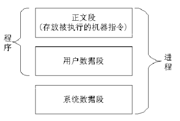

# 1.进程和程序

进程是一个动态实体，如图所示，进程实体由三个独立的部分组成:
* 正文段(Text）：存放被执行的机器指令。这个段是只读的(所以，在这里不能写自己能修改的代码），它允许系统中正在运行的两个或多个进程之间能够共享这一代码
* 用户数据段(User Segment）：存放进程在执行时直接进行操作的所有数据，包括进程使用的全部变量在内。显然，这里包含的信息可以被改变。虽然进程之间可以共享正文段，但是每个进程需要有它自己的专用用户数据段
* 系统数据段(System Segment）：该段有效地存放程序运行的环境。事实上，这正是程序和进程的区别所在。
# 2.Linux中的进程概述
> Linux 中的每个进程由一个 task_struct 数据结构来描述，在 Linux 中，任务(Task）和进程(Process）是两个相同的术语，task_struct 其实就是通常所说的“进程控制块”即PCB。task_struct 容纳了一个进程的所有信息，是系统对进程进行控制的唯一手段
# 3.task_struct结构描述
## 3.1 进程状态(State)
进程状态是调度和对换的依据,Linux的进程主要有以下状态
|内核表示|含义
|:--|:--
|TASK_RUNNING |可运行 
|TASK_INTERRUPTIBLE |可中断的等待状态 
|TASK_UNINTERRUPTIBLE |不可中断的等待状态
|TASK_ZOMBIE |僵死 
|TASK_STOPPED |暂停 
|TASK_SWAPPING |换入/换出

[1] 可运行状态  

处于这种状态的进程，要么正在运行、要么正准备运行。正在运行的进程就是当前进程(由 current 所指向的进程），而准备运行的进程只要得到 CPU 就可以立即投入运行，CPU 是这些进程唯一等待的系统资源。系统中有一个运行队列`run_queue`,用来容纳所有处于可运行状态的进程，调度程序执行时，从中选择一个进程投入运行。在后面我们讨论进程调度的时候，可以看到运行队列的作用。当前运行进程一直处于该队列中，也就是说，current总是指向运行队列中的某个元素，只是具体指向谁由调度程序决定。   
[2] 等待状态  

处于该状态的进程正在等待某个事件(Event）或某个资源，它肯定位于系统中的某个等待队列(wait_queue）中。Linux 中处于等待状态的进程分为两种：可中断的等待状态和不可中断的等待状态。处于可中断等待态的进程可以被信号唤醒，如果收到信号，该进程就从等待状态进入可运行状态，并且加入到运行队列中，等待被调度；而处于不可中断等待态的进程是因为硬件环境不能满足而等待，例如等待特定的系统资源，它任何情况下都不能被打断，只能用特定的方式来唤醒它，例如唤醒函数 wake_up(）等。   
[3] 暂停状态
此时的进程暂时停止运行来接受某种特殊处理。通常当进程接收到 SIGSTOP、SIGTSTP、SIGTTIN 或 SIGTTOU 信号后就处于这种状态。例如，正接受调试的进程就处于这种状态。 

[4] 僵死状态  

进程虽然已经终止，但由于某种原因，父进程还没有执行 wait()系统调用，终止进程的信息也还没有回收。顾名思义，处于该状态的进程就是死进程，这种进程实际上是系统中的垃圾，必须进行相应处理以释放其占用的资源。
## 3.2 进程调度信息
调度程序利用这部分信息决定系统中哪个进程最应该运行，并结合进程的状态信息保证系统运转的公平和高效。这一部分信息通常包括进程的类别(普通进程还是实时进程）、进程的优先级等
|域名|定义
|:--|:--
|need_resched |调度标志 
|Nice |静态优先级 
|Counter |动态优先级 
|Policy |调度策略 
|rt_priority |实时优先级 

当 need_resched 被设置时，在“下一次的调度机会”就调用调度程序 schedule()counter 代表进程剩余的时间片，是进程调度的主要依据，也可以说是进程的动态优先级，因为这个值在不断地减少；nice 是进程的静态优先级，同时也代表进程的时间片，用于对 counter 赋值，可以用 nice()系统调用改变这个值；policy
是适用于该进程的调度策略，实时进程和普通进程的调度策略是不同的；rt_priority 只对实时进程有意义，它是实时进程调度的依据。
## 3.3 标识符
每个进程有进程标识符、用户标识符、组标识符    
进程标识符(PID，process identifier），每个进程都有一个唯一的标识符，内核通过这个标识符来识别不同的进程，同时，进程标识符 PID 也是内核提供给用户程序的接口，用户程序通过 PID 对进程发号施令。PID 是 32 位的无符号整数，它被顺序编号：新创建进程的 PID通常是前一个进程的 PID 加 1。然而，为了与 16 位硬件平台的传统 Linux 系统保持兼容，在Linux 上允许的最大 PID 号是 32767，当内核在系统中创建第 32768 个进程时，就必须重新开始使用已闲置的 PID 号。 
|域名|含义
|:--|:--
|Pid |进程标识符 
|Uid、gid |用户标识符、组标识符 
|Euid、egid |有效用户标识符、有效组标识符 
|Suid、sgid |备份用户标识符、备份组标识符 
|Fsuid、fsgid |文件系统用户标识符、文件系统组标识符 
## 3.4 进程间通信
Linux 支持多种不同形式的通信机制。它支持典型的 UNIX 通信机制(IPC Mechanisms）：信号(Signals）、管道(Pipes），也支持 System V 通信机制：共享内(Shared Memory）、信号量和消息队列(Message Queues）,如表所示
|域名|含义
|:--|:--
|Spinlock_t |sigmask_lock 信号掩码的自旋锁 
|Long blocked |信号掩码 
|Struct signal *sig |信号处理函数 
|Struct sem_undo *semundo |为避免死锁而在信号量上设置的取消操作 
|Struct sem_queue *semsleeping |与信号量操作相关的等待队列
## 3.5 进程链接
程序创建的进程具有父/子关系。因为一个进程能创建几个子进程，而子进程之间有兄
弟关系，在 task_struct 结构中有几个域来表示这种关系。    

在 Linux 系统中，除了初始化进程 init，其他进程都有一个父进程（Parent Process）或称为双亲进程。可以通过 fork（）或 clone()系统调用来创建子进程，除了进程标识符（PID）等必要的信息外，子进程的 task_struct 结构中的绝大部分的信息都是从父进程中拷贝

每个进程的 task_struct 结构有许多指针，通过这些指针，系统中所有进程的
task_struct结构就构成了一棵进程树，这棵进程树的根就是初始化进程 init的 task_struct结构（init 进程是 Linux 内核建立起来后人为创建的一个进程，是所有进程的祖先进程）。
下图为所有进程的链接信息
|名称|英文解释|中文解释
|:--|:--|:--
|p_opptr |Original parent |祖先 
|p_pptr|Parent |父进程 
|p_cptr |Child |子进程 
|p_ysptr |Younger sibling |弟进程 
|p_osptr |Older sibling |兄进程 
|Pidhash_next,Pidhash_pprev | | 进程在哈希表中的链接 
|Next_task,prev_task | |进程在双向循环链表中的链接 
|Run_list | |运行队列的链表 
## 3.6 时间和定时器信息
一个进程从创建到终止叫做该进程的生存期（lifetime）。进程在其生存期内使用 CPU的时间，内核都要进行记录，以便进行统计、计费等有关操作。进程耗费 CPU 的时间由两部分组成：一是在用户模式（或称为用户态）下耗费的时间、一是在系统模式（或称为系统态）下耗费的时间。每个时钟滴答，也就是每个时钟中断，内核都要更新当前进程耗费 CPU 的时间信息  
下表是和时间有关的域:
|域名|含义
|:--|:--
|Start_time |进程创建时间 
|Per_cpu_utime |进程在某个 CPU 上运行时在用户态下耗费的时间 
|Per_cpu_stime |进程在某个 CPU 上运行时在系统态下耗费的时间 
|Counter |进程剩余的时间片

|定时器类型|解释|更新时间|表示该定时器的域
|:--|:--|:--
|ITIMER_REAL 实时定时器 it_real_incr 实时更新，即不论该进程是否
运行 
real_timer 
it_virt_value 
ITIMER_VIRTUAL 虚拟定时器 只在进程运行于用户态时更
新 it_virt_incr 
it_prof_value ITIMER_PROF 概况定时器 进程运行于用户态和系统态
时更新 it_prof_incr 