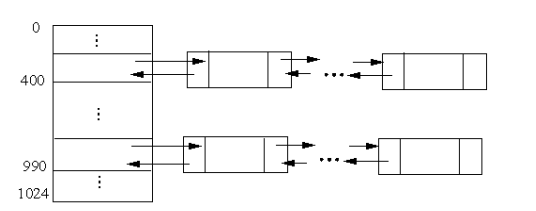

# 5.进程组织方式
在 Linux 中，可以把进程分为用户任务和内核线程，不管是哪一种进程，它们都有自己的task_struct,对于Linux中的众多进程,Linux采用了如下组织方式:
## 5.1 哈希表
哈希表是进行快速查找的一种有效的组织方式。Linux 在进程中引入的哈希表叫做
pidhash，在`include/linux/sched.h`中定义如下
```c
#define PIDHASH_SZ (4096 >> 2) 
extern struct task_struct *pidhash[PIDHASH_SZ]; 
#define pid_hashfn(x) ((((x) >> 8) ^ (x)) & (PIDHASH_SZ - 1))
```
其中，PIDHASH_SZ 为表中元素的个数，表中的元素是指向 task_struct 结构的指针。pid_hashfn 为哈希函数，把进程的 PID 转换为表的索引。通过这个函数，可以把进程的 PID均匀地散列在它们的域（0 到 PID_MAX-1）中。   

同时我们也知道,哈希函数并不能确保PID和表的索引一一对应,两个不同的PID散列到相同的索引称为冲突  

Linux 利用链地址法来处理冲突的 PID：也就是说，每一表项是由冲突的 PID 组成的双向链表，这种链表是由 task_struct 结构中的 pidhash_next pidhash_pprev 域实现的，同一链表中 pid 的大小由小到大排列。如图所示。

哈希表 pidhash 中插入和删除一个进程时可以调用 hash_ pid() 和 unhash_ pid()函数。对于一个给定的 pid，可以通过 find_task_by_pid()函数快速地找到对应的进程
```c
static inline struct task_struct *find_task_by_pid（int pid） 
{
    struct task_struct *p, *htable = &pidhash[pid_hashfn(pid)]; 
    for（p = *htable; p && p->pid != pid; p = p->pidhash_next） 
                 ; 
    return p; 
} 
```
## 5.2 双向循环链表
哈希表的主要作用是根据进程的 pid 可以快速地找到对应的进程，但它没有反映进程创建的顺序，也无法反映进程之间的亲属关系，因此引入双向循环链表。每个进程 task_struct 结构中的 prev_task 和 next_task 域用来实现这种链表，如图所示。

宏`SET_LINK`用来在该链表中插入一个元素
```c
#define SET_LINKS（p） do { \ 
 （p）->next_task = &init_task; \ 
 （p）->prev_task = init_task.prev_task; \ 
 init_task.prev_task->next_task = （p）; \ 
 init_task.prev_task = （p）; \ 
 （p）->p_ysptr = NULL; \ 
 if （（（p）->p_osptr = （p）->p_pptr->p_cptr） != NULL） \ 
 （p）->p_osptr->p_ysptr = p; \ 
 （p）->p_pptr->p_cptr = p; \ 
 } while （0） 
```
从代码中我们可以看出,链表的头和尾都为`init_task`,它对应的进程为0，也就是空进程，这是所有进程的祖先，这个宏把进程之间的亲属关系也链接起来，此外还有一个宏`for_rach_task()`
```
#define for_each_task（p） \ 
 for （p = &init_task ; （p = p->next_task） != &init_task ; ）
```
因为进程的双向循环链表是一个临界资源，因此使用该宏时一定要加锁，使用之后再开锁
## 5.3 运行队列
当内核要寻找一个新的进程在 CPU 上运行时，必须只考虑处于可运行状态的进程（即在TASK_RUNNING 状态的进程），因为扫描整个进程链表是相当低效的，所以引入了可运行状态进程的双向循环链表，也叫运行队列（runqueue)  
运行队列容纳了系统中所有可以运行的进程，它是一个双向循环队列，其结构如图所示
## 5.4 进程的运行队列链表
该队列通过 task_struct 结构中的两个指针 run_list 链表来维持。队列的标志有两个：一个是“空进程”idle_task，一个是队列的长度。   

有两个特殊的进程永远在运行队列中待着：当前进程和空进程。前面我们讨论过，当前进程就是由 cureent 指针所指向的进程，也就是当前运行着的进程;空进程是个比较特殊的进程，只有系统中没有进程可运行时它才会被执行，Linux 将它看作运行队列的头，当调度程序遍历运行队列，是从 idle_task 开始、至 idle_task 结束的，在调度程序运行过程中，允许队列中加入新出现的可运行进程，新出现的可运行进程插入到队尾，这样的好处是不会影响到调度程序所要遍历的队列成员  
另一个重要标志是队列长度，也就是系统中处于可运行状态（TASK_RUNNING）的进程数目，用全局整型变量`nr_running`表示，在`/kernel/fork.c`中定义如下：
```c
int nr_running=1;
```
若 nr_running 为 0,就表示队列中只有空进程,在这里要说明一下:若 nr_running 为0,则系统中的当前进程和空进程就是同一个进程。但是 Linux 会充分利用CPU而尽量避免出现这种情况
## 5.5 等待队列
1. 通用双向链表
在`include/linux/list.h` 中定义了这种链表： 
```c
struct list_head { 
 struct list_head *next, *prev; 
}; 
```
这是双向链表的一个基本框架，在其他使用链表的地方就可以使用它来定义任意一个双
向链表，例如： 
```c
struct foo_list { 
 int data; 
 struct list_head list; 
}; 
```
对于 list_head 类型的链表，Linux 定义了 5 个宏：
```c
#define LIST_HEAD_INIT（name） { &（name）, &（name） } 
#define LIST_HEAD（name） \ 
 struct list_head name = LIST_HEAD_INIT（name） 
#define INIT_LIST_HEAD（ptr） do { \ 
 （ptr）->next = （ptr）; （ptr）->prev = （ptr）; \ 
} while （0） 
#define list_entry（ptr, type, member） \ 
 （（type *）（（char *）（ptr）-（unsigned long）（&（（type *）0）->member））） 
#define list_for_each（pos, head） \ 
 for （pos = （head）->next; pos != （head）; pos = pos->next） 
```
前 3 个宏都是初始化一个空的链表，但用法不同，LIST_HEAD_INIT()在声明时使用，用来初始化结构元素，第 2 个宏用在静态变量初始化的声明中，而第 3 个宏用在函数内部。 
其中，最难理解的宏为 list_entry（），在内核代码的很多处都用到这个宏，例如，在
调度程序中，从运行队列中选择一个最值得运行的进程，部分代码如下：
```c
static LIST_HEAD（runqueue_head）; 
struct list_head *tmp; 
struct task_struct *p; 
list_for_each（tmp, &runqueue_head） { 
 p = list_entry（tmp, struct task_struct, run_list）; 
 if （can_schedule（p）） { 
 int weight = goodness（p, this_cpu, prev->active_mm）; 
 if （weight > c） 
 c = weight, next = p; 
 } 
} 
```
从这段代码可以分析出 list_entry(ptr, type, member)宏及参数的含义： ptr 是
指向 list_ head 类型链表的指针，type 为一个结构，而 member 为结构 type 中的一个域，类型为 list_head，这个宏返回指向 type 结构的指针 

另 外 ， 对 list_head类型的链表进行删除和插入(头或尾)的宏为`list_del()/list_add()/list_ add_tail()`，在内核的其他函数中可以调用这些宏。例如，从运行队列中删除、增加及移动一个任务的代码如下：
```c
static inline void del_from_runqueue（struct task_struct * p） 
{ 
 nr_running--; 
 list_del（&p->run_list）; 
 p->run_list.next = NULL; 
} 
static inline void add_to_runqueue（struct task_struct * p） 
{ 
 list_add（&p->run_list, &runqueue_head）; 
 nr_running++; 
} 
static inline void move_last_runqueue（struct task_struct * p） 
{ 
 list_del（&p->run_list）; 
 list_add_tail（&p->run_list, &runqueue_head）; 
} 
static inline void move_first_runqueue（struct task_struct * p） 
{ 
 list_del（&p->run_list）; 
 list_add（&p->run_list, &runqueue_head）; 
} 
```
2. 等待队列
运行队列链表把处于 TASK_RUNNING 状态的所有进程组织在一起。当要把其他状态的进程分组时，不同的状态要求不同的处理,Linux选择了下列方式之一。   
* TASK_STOPPED 或 TASK_ZOMBIE 状态的进程不链接在专门的链表中，也没必要把它们分组，因为父进程可以通过进程的 PID 或进程间的亲属关系检索到子进程。 
* 把 TASK_INTERRUPTIBLE 或 TASK_UNINTERRUPTIBLE 状态的进程再分成很多类，其每一类对应一个特定的事件。在这种情况下，进程状态提供的信息满足不了快速检索进程，因此，有必要引入另外的进程链表。这些链表叫等待队列。  

等待队列表示一组睡眠的进程,当某一条件变为真时，由内核唤醒它们，等待队列由循环链表实现,等待队列的定义如下:
```c
struct __wait_queue { 
 unsigned int flags; 
 struct task_struct * task; 
 struct list_head task_list; 
} ; 
typedef struct __wait_queue wait_queue_t ;
```
关于等待队列另一个重要的数据结构—等待队列首部的描述如下
```c
struct __wait_queue_head { 
 wq_lock_t lock; 
 struct list_head task_list; 
}; 
typedef struct __wait_queue_head wait_queue_head_t; 
```
对于等待队列的操作函数,主要函数如下:
* init_waitqueue_head（）—对等待队列首部进行初始化 
* init_waitqueue_entry（）－对要加入等待队列的元素进行初始化 
* waitqueue_active（）—判断等待队列中已经没有等待的进程 
* add_wait_queue（）—给等待队列中增加一个元素 
* remove_wait_queue（）—从等待队列中删除一个元素 
注意,在以上函数的实现 中 ， 都 调 用 了 对 list_head 类型链表的操作函数（list_del()/list_add()/list_add_tail()），因此可以说，list_head 类型相当于 C++中的基类型   

sleep_on()函数对当前的进程起作用，我们把当前进程叫做 P：
```c
sleep_on（wait_queue_head_t *q） 
{ 
 SLEEP_ON_VAR ／＊宏定义，用来初始化要插入到等待队列中的元素＊／ 
 current->state = TASK_UNINTERRUPTIBLE; 
 SLEEP_ON_HEAD ／＊宏定义，把 P 插入到等待队列 ＊／ 
schedule（）; 
 SLEEP_ON_TAIL ／＊宏定义把 P 从等待队列中删除 ＊／ 
} 
```
这个函数把 P 的状态设置为 TASK_UNINTERRUPTIBLE，并把 P 插入等待队列。然后，它调用调度程序恢复另一个程序的执行。当 P 被唤醒时，调度程序恢复 sleep_on( )函数的执行，把 P 从等待队列中删除
* interruptible_sleep_on()与 sleep_on()函数是一样的，但稍有不同，前者把
进程 P 的状态设置为 TASK_INTERRUPTIBLE 而不是 TASK_UNINTERRUPTIBLE ，因此，通过接受一个信号可以唤醒 P。
* sleep_on_timeout() 和 interruptible_sleep_on_timeout()与前面情况类似，
但它们允许调用者定义一个时间间隔，过了这个间隔以后，内核唤醒进程。为了做到这点，它们调用 schedule_timeout()函数而不是 schedule()函数。   
利用 wake_up 或者 wake_up_interruptible 宏，让插入等待队列中的进程进入
TASK_RUNNING 状态，这两个宏最终都调用了 try_to_wake_up()函数：