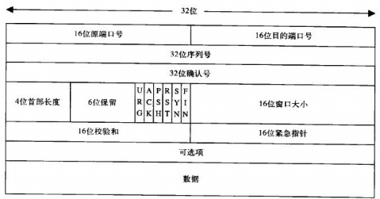

## 9.3 TCP协议源码分析

TCP 协议位于 TCP/IP 协议栈的第四层，也就是传输层，其建立在网络层的 IP 协议。如下图：


但由于 IP 协议是一个无连接不可靠的协议，所以 TCP 协议要实现面向连接的可靠传输，就必须为每个 CS（Client - Server） 连接维护一个连接状态。由此可知，TCP 协议的连接只是维护了一个连接状态，而非真正的连接。


### 9.3.1 三次握手过程

为了实现面向连接，TCP 协议使用了一种协商的方式来建立连接状态，称为：`三次握手`。`三次握手` 的过程如下图

建立连接过程如下：

- 客户端需要发送一个 `SYN包` 到服务端（包含了客户端初始化序列号），并且将连接状态设置为 `SYN_SENT`。
- 服务端接收到客户端的 `SYN包` 后，需要回复一个 `SYN+ACK包` 给客户端（包含了服务端初始化序列号），并且设置连接状态为 `SYN_RCVD`。
- 客户端接收到服务端的 `SYN+ACK包` 后，设置连接状态为 `ESTABLISHED`（表示连接已经建立），并且回复一个 `ACK包` 给服务端。
- 服务端接收到客户端的 `ACK包` 后，将连接状态设置为 `ESTABLISHED`（表示连接已经建立）。

以上过程完成后，一个 TCP 连接就此建立完成。


### 9.3.2 TCP头部

TCP头部格式如下：



TCP 头部各个字段的作用：

- `源端口号`：用于指定本地程序绑定的端口。
- `目的端口号`：用于指定远端程序绑定的端口。
- `序列号`：用于本地发送数据时所使用的序列号。
- `确认号`：用于本地确认接收到远端发送过来的数据序列号。
- `首部长度`：指示 TCP 头部的长度。
- `标志位`：用于指示 TCP 数据包的类型。
- `窗口大小`：用于流量控制，表示远端能够接收数据的能力。
- `校验和`：用于校验数据包是否在传输时损坏了。
- `紧急指针`：一般比较少用，用于指定紧急数据的偏移量（`URG` 标志位为1时有效）。
- `可选项`：TCP的选项部分。

Linux 内核定义 TCP 头部的结构如下：

```c
struct tcphdr {
    __u16   source;   // 源端口
    __u16   dest;     // 目的端口
    __u32   seq;      // 序列号
    __u32   ack_seq;  // 确认号
    __u16   doff:4,   // 头部长度
            res1:4,   // 保留
            res2:2,   // 保留
            urg:1,    // 是否包含紧急数据
            ack:1,    // 是否ACK包
            psh:1,    // 是否Push包
            rst:1,    // 是否Reset包
            syn:1,    // 是否SYN包
            fin:1;    // 是否FIN包
    __u16   window;   // 滑动窗口
    __u16   check;    // 校验和
    __u16   urg_ptr;  // 紧急指针
};
```

从上面的定义可知，结构 `tcphdr` 的各个字段与 TCP 头部的各个字段一一对应。


### 9.3.3 客户端连接过程

一个 TCP 连接是由客户端发起的，当客户端程序调用 `connect()` 系统调用时，就会与服务端程序建立一个 TCP 连接。`connect()` 系统调用的原型如下：

```
int connect(int sockfd, const struct sockaddr *addr, socklen_t addrlen);
```

下面是 `connect()` 系统调用各个参数的作用：

- `sockfd`：由 `socket()` 系统调用创建的文件句柄。
- `addr`：指定要连接的远端 IP 地址和端口。
- `addrlen`：指定参数 `addr` 的长度。

当客户端调用 `connect()` 函数时，会触发内核调用 `sys_connect()` 内核函数，`sys_connect()` 函数实现如下：

```c
int sys_connect(int fd, struct sockaddr *uservaddr, int addrlen)
{
    struct socket *sock;
    char address[MAX_SOCK_ADDR];
    int err;
    ...
    // 获取文件句柄对应的socket对象c
    sock = sockfd_lookup(fd, &err);
    ...
    // 从用户空间复制要连接的远端IP地址和端口信息
    err = move_addr_to_kernel(uservaddr, addrlen, address);
    ...
    // 调用 inet_stream_connect() 函数完成连接操作
    err = sock->ops->connect(sock, (struct sockaddr *)address, addrlen,
                             sock->file->f_flags);
    ...
    return err;
}
```

`sys_connect()` 内核函数主要完成 3 个步骤：

- 调用 `sockfd_lookup()` 函数获取 `fd` 文件句柄对应的 socket 对象。
- 调用 `move_addr_to_kernel()` 函数从用户空间复制要连接的远端 IP 地址和端口信息。
- 调用 `inet_stream_connect()` 函数完成连接操作。

我们继续分析 `inet_stream_connect()` 函数的实现：

```c
int inet_stream_connect(struct socket *sock, struct sockaddr * uaddr,
                        int addr_len, int flags)
{
    struct sock *sk = sock->sk;
    int err;
    ...
    if (sock->state == SS_CONNECTING) {
        ...
    } else {
        // 尝试自动绑定一个本地端口
        if (inet_autobind(sk) != 0) 
            return(-EAGAIN);
        ...
        // 调用 tcp_v4_connect() 进行连接操作
        err = sk->prot->connect(sk, uaddr, addr_len);
        if (err < 0)
            return(err);
        sock->state = SS_CONNECTING;
    }
    ...
    // 如果 socket 设置了非阻塞, 并且连接还没建立, 那么返回 EINPROGRESS 错误
    if (sk->state != TCP_ESTABLISHED && (flags & O_NONBLOCK))
        return (-EINPROGRESS);

    // 等待连接过程完成
    if (sk->state == TCP_SYN_SENT || sk->state == TCP_SYN_RECV) {
        inet_wait_for_connect(sk);
        if (signal_pending(current))
            return -ERESTARTSYS;
    }
    sock->state = SS_CONNECTED; // 设置socket的状态为connected
    ...
    return(0);
}
```

`inet_stream_connect()` 函数的主要操作有以下几个步骤：

- 调用 `inet_autobind()` 函数尝试自动绑定一个本地端口。
- 调用 `tcp_v4_connect()` 函数进行 TCP 协议的连接操作。
- 如果 socket 设置了非阻塞，并且连接还没建立完成，那么返回 EINPROGRESS 错误。
- 调用 `inet_wait_for_connect()` 函数等待连接服务端操作完成。
- 设置 socket 的状态为 `SS_CONNECTED`，表示连接已经建立完成。

在上面的步骤中，最重要的是调用 `tcp_v4_connect()` 函数进行连接操作，我们来分析一下 `tcp_v4_connect()` 函数的实现：

```c
int tcp_v4_connect(struct sock *sk, struct sockaddr *uaddr, int addr_len)
{
    struct tcp_opt *tp = &(sk->tp_pinfo.af_tcp);
    struct sockaddr_in *usin = (struct sockaddr_in *)uaddr;
    struct sk_buff *buff;
    struct rtable *rt;
    u32 daddr, nexthop;
    int tmp;
    ...
    nexthop = daddr = usin->sin_addr.s_addr;
    ...
    // 1. 获取发送数据的路由信息
    tmp = ip_route_connect(&rt, nexthop, sk->saddr,
                           RT_TOS(sk->ip_tos)|RTO_CONN|sk->localroute,
                           sk->bound_dev_if);
    ...
    dst_release(xchg(&sk->dst_cache, rt)); // 2. 设置sk的路由信息

    // 3. 申请一个skb数据包对象
    buff = sock_wmalloc(sk, (MAX_HEADER + sk->prot->max_header), 0, GFP_KERNEL);
    ...
    sk->dport = usin->sin_port; // 4. 设置目的端口
    sk->daddr = rt->rt_dst;     // 5. 设置目的IP地址
    ...
    if (!sk->saddr)
        sk->saddr = rt->rt_src; // 6. 如果没有指定源IP地址, 那么使用路由信息的源IP地址
    sk->rcv_saddr = sk->saddr;
    ...
    // 7. 初始化TCP序列号
    tp->write_seq = secure_tcp_sequence_number(sk->saddr, sk->daddr, sk->sport,
                                               usin->sin_port);
    ...
    // 8. 重置TCP最大报文段大小
    tp->mss_clamp = ~0;
    ...
    // 9. 调用 tcp_connect() 函数继续进行连接操作
    tcp_connect(sk, buff, rt->u.dst.pmtu);
    return 0;
}
```

`tcp_v4_connect()` 函数只是做一些连接前的准备工作，如下：

- 调用 `ip_route_connect()` 函数获取发送数据的路由信息，并且将路由信息保存到 socket 对象的路由缓存中。
- 调用 `sock_wmalloc()` 函数申请一个 skb 数据包对象。
- 设置 `目的端口` 和 `目的 IP 地址`。
- 如果没有指定 `源 IP 地址`，那么使用路由信息中的 `源 IP 地址`。
- 调用 `secure_tcp_sequence_number()` 函数初始化 TCP 序列号。
- 重置 TCP 协议最大报文段的大小。
- 调用 `tcp_connect()` 函数发送 `SYN包` 给服务端程序。

由于 `TCP三次握手` 的第一步是由客户端发送 `SYN包` 给服务端，所以我们主要关注 `tcp_connect()` 函数的实现，其代码如下：

```c
void tcp_connect(struct sock *sk, struct sk_buff *buff, int mtu)
{
    struct dst_entry *dst = sk->dst_cache;
    struct tcp_opt *tp = &(sk->tp_pinfo.af_tcp);

    skb_reserve(buff, MAX_HEADER + sk->prot->max_header); // 保留所有的协议头部空间

    tp->snd_wnd = 0;
    tp->snd_wl1 = 0;
    tp->snd_wl2 = tp->write_seq;
    tp->snd_una = tp->write_seq;
    tp->rcv_nxt = 0;
    sk->err = 0;
    // 设置TCP头部长度
    tp->tcp_header_len = sizeof(struct tcphdr) +
                           (sysctl_tcp_timestamps ? TCPOLEN_TSTAMP_ALIGNED : 0);
    ...
    tcp_sync_mss(sk, mtu); // 设置TCP报文段最大长度
    ...
    TCP_SKB_CB(buff)->flags = TCPCB_FLAG_SYN; // 设置SYN标志为1(表示这是一个SYN包)
    TCP_SKB_CB(buff)->sacked = 0;
    TCP_SKB_CB(buff)->urg_ptr = 0;
    buff->csum = 0;
    TCP_SKB_CB(buff)->seq = tp->write_seq++;   // 设置序列号
    TCP_SKB_CB(buff)->end_seq = tp->write_seq; // 设置确认号
    tp->snd_nxt = TCP_SKB_CB(buff)->end_seq;

    // 初始化滑动窗口的大小
    tp->window_clamp = dst->window;
    tcp_select_initial_window(sock_rspace(sk)/2, tp->mss_clamp,
                              &tp->rcv_wnd, &tp->window_clamp,
                              sysctl_tcp_window_scaling, &tp->rcv_wscale);
    ...
    tcp_set_state(sk, TCP_SYN_SENT); // 设置 socket 的状态为 SYN_SENT

    // 调用 tcp_v4_hash() 函数把 socket 添加到 tcp_established_hash 哈希表中
    sk->prot->hash(sk);

    tp->rto = dst->rtt;
    tcp_init_xmit_timers(sk); // 设置超时重传定时器
    ...
    // 把 skb 添加到 write_queue 队列中, 用于重传时使用
    __skb_queue_tail(&sk->write_queue, buff);
    TCP_SKB_CB(buff)->when = jiffies;
    ...
    // 调用 tcp_transmit_skb() 函数构建 SYN 包发送给服务端程序
    tcp_transmit_skb(sk, skb_clone(buff, GFP_KERNEL));
    ...
}
```

`tcp_connect()` 函数的实现虽然比较长，但是逻辑相对简单，就是设置 TCP 头部各个字段的值，然后把数据包发送给服务端。下面列出 `tcp_connect()` 函数主要的工作：

- 设置 TCP 头部的 `SYN 标志位` 为 1 (表示这是一个 `SYN包`)。
- 设置 TCP 头部的序列号和确认号。
- 初始化滑动窗口的大小。
- 设置 socket 的状态为 `SYN_SENT`，可参考上面三次握手的状态图。
- 调用 `tcp_v4_hash()` 函数把 socket 添加到 `tcp_established_hash` 哈希表中，用于通过 IP 地址和端口快速查找到对应的 socket 对象。
- 设置超时重传定时器。
- 把 skb 添加到 `write_queue` 队列中, 用于超时重传。
- 调用 `tcp_transmit_skb()` 函数构建 `SYN包` 发送给服务端程序。

通过上面的分析，构建 `SYN包` 并且发送给服务端是通过 `tcp_transmit_skb()` 函数完成的，所以我们来分析一下 `tcp_transmit_skb()` 函数的实现：

```c
void tcp_transmit_skb(struct sock *sk, struct sk_buff *skb)
{
    if (skb != NULL) {
        struct tcp_opt *tp = &(sk->tp_pinfo.af_tcp);
        struct tcp_skb_cb *tcb = TCP_SKB_CB(skb);
        int tcp_header_size = tp->tcp_header_len;
        struct tcphdr *th;
        ...
        // TCP头部指针
        th = (struct tcphdr *)skb_push(skb, tcp_header_size);
        skb->h.th = th;

        skb_set_owner_w(skb, sk);

        // 构建 TCP 协议头部
        th->source = sk->sport;                // 源端口
        th->dest = sk->dport;                  // 目标端口
        th->seq = htonl(TCP_SKB_CB(skb)->seq); // 请求序列号
        th->ack_seq = htonl(tp->rcv_nxt);      // 应答序列号
        th->doff = (tcp_header_size >> 2);     // 头部长度
        th->res1 = 0;
        *(((__u8 *)th) + 13) = tcb->flags;     // 设置TCP头部的标志位

        if (!(tcb->flags & TCPCB_FLAG_SYN))
            th->window = htons(tcp_select_window(sk)); // 滑动窗口大小

        th->check = 0;                                 // 校验和
        th->urg_ptr = ntohs(tcb->urg_ptr);             // 紧急指针
        ...
        // 计算TCP头部的校验和
        tp->af_specific->send_check(sk, th, skb->len, skb);
        ...
        tp->af_specific->queue_xmit(skb); // 调用 ip_queue_xmit() 函数发送数据包
    }
}
```

`tcp_transmit_skb()` 函数的实现相对简单，就是构建 TCP 协议头部，然后调用 `ip_queue_xmit()` 函数将数据包交由 IP 协议发送出去。

至此，客户端就发送了一个 `SYN包` 给服务端，也就是说，`TCP 三次握手` 的第一步已经完成。
